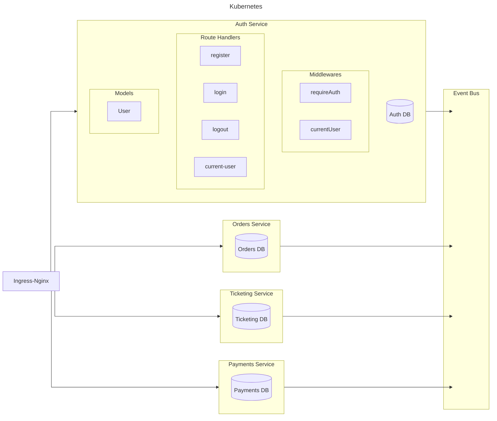

```mermaid
---
title: Kubernetes
---
%%{ init: { 'flowchart': { 'curve': 'step' } } }%%
flowchart LR
   nginx[Ingress-Nginx]

   subgraph srvAuth[Auth Service]
      subgraph authMw[Middlewares]
         requireAuth
         currentUser
      end
      subgraph authRH[Route Handlers]
         register
         login
         logout
         current-user
      end
      subgraph authM[Models]
         User
      end
      dbAuth[(Auth DB)]
   end

   subgraph srvOrders[Orders Service]
      dbOrders[(Orders DB)]
   end

   subgraph srvTicketing[Ticketing Service]
      dbTicketing[(Ticketing DB)]
   end

   subgraph srvPayments[Payments Service]
      dbPayments[(Payments DB)]
   end

   subgraph bus[Event Bus]
      h1
      h2
      h3
      h4
   end

   srvAuth --> h1
   srvOrders --> h2
   srvTicketing --> h3
   srvPayments --> h4

   nginx --> srvAuth
   nginx --> srvOrders
   nginx --> srvTicketing
   nginx --> srvPayments

   classDef hidden opacity:0
   classDef fullHeight height:20%
   %%class bus fullHeight
   class h1,h2,h3,h4 hidden

```
